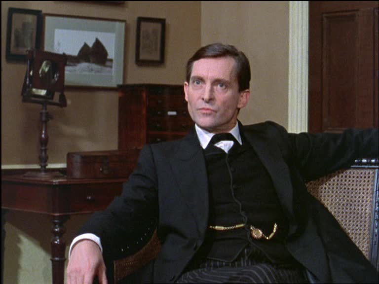
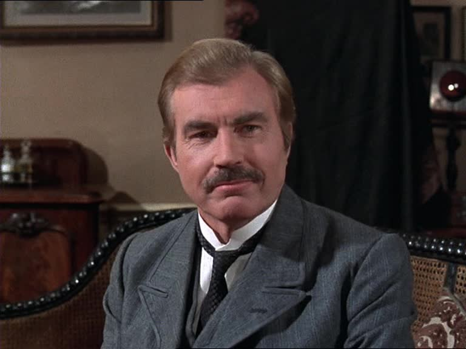
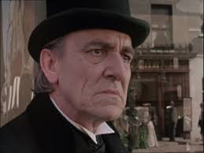
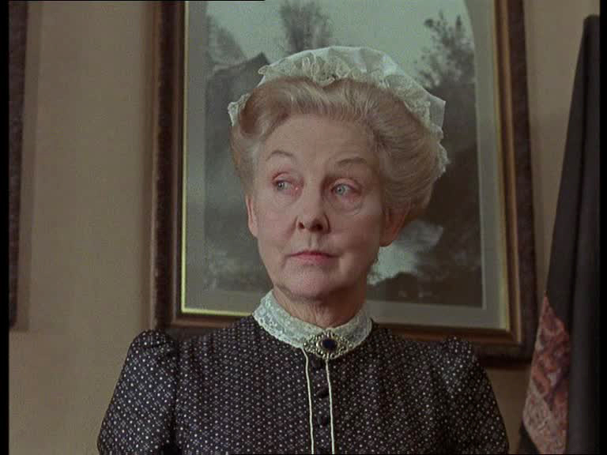

# English Language 3
## Lesson 3
### Units: 94 (Frequency Adverbs), 85-86 (Adjectives/Adverbs), 97 (Conjunctions)

Prof. Pedro Groppo / DLEM-UFPB


---

# Quick Review from Last Class

## What we learned: Adjective order and positions

- "The **brilliant young English** detective" 
  (opinion + age + origin)
- "She **looks tired** but **sounds enthusiastic**"

## ISF event

## Today: What characters DO and HOW they do it

---

# Today's Character Bank

## Sherlock Holmes Universe
- **Sherlock Holmes** - The brilliant detective
- **Dr. Watson** - The loyal companion
- **Mrs. Hudson** - The long-suffering landlady
- **Moriarty** - The criminal mastermind
- **Inspector Lestrade** - The Scotland Yard detective
- **Irene Adler** - The clever adversary
- **Mycroft Holmes** - The government official brother

---

# Block 1: Daily Routines & Habits

## Grammar Focus: Present Simple + Frequency Adverbs

### Units 5-6: Present Simple Review
- He/she/it + verb-s: "Sherlock Holmes **solves** crimes"
- Negatives: "Watson **doesn't** deduce like Holmes"
- Special forms: have→has, do→does, go→goes

---

# Unit 94: Frequency Adverbs & Position

```
Always    Usually    Often    Sometimes    Rarely    Never
100% ------------------------------------------------ 0%
```

## Position rules:
1. **Before main verb:** "Sherlock **often** solves cases"
2. **After BE:** "He **is** always **observant**"
3. **Between auxiliaries:** "He **has** never **been** wrong"

---

## Unit 86: Adverbs of Manner (HOW)

### Form: adjective + -ly
- careful → carefully
- quick → quickly
- dramatic → dramatically

### Irregular forms:
- good → well
- fast → fast
- hard → hard

### Position: usually at the end OR after the object

---

### Activity 1: Daily Routine Story

#### Teacher Model - Sherlock Holmes:

"Sherlock Holmes **rarely** wakes up before noon. He **usually** drinks tea **dramatically** while thinking about mysteries. He **often** plays violin **badly** when he's frustrated. He **sometimes** disappears **mysteriously** for days. He **never** cleans his apartment **properly** because he's **always** too busy solving crimes **brilliantly**."



---

#### Your Turn: Daily Routine Story

#### Requirements:
- Use frequency adverbs (always, usually, often, sometimes, rarely, never)
- Use adverbs of manner (carefully, quickly, nervously, etc.)
- Mix positions for variety
- 5 sentences

#### For instance:
- What time does your character get up? How?
- What do they do first? In what manner?
- How do they work/train/study?
- What unusual habits do they have?

**Time:** 10 minutes writing + 5 minutes sharing

---

#### Teacher Model - Sherlock Holmes:

"Sherlock Holmes **rarely** wakes up before noon. He **usually** drinks tea **dramatically** while thinking about mysteries. He **often** plays violin **badly** when he's frustrated. He **sometimes** disappears **mysteriously** for days. He **never** cleans his apartment **properly** because he's **always** too busy solving crimes **brilliantly**."

#### Requirements:
- Use frequency adverbs (always, usually, often, sometimes, rarely, never)
- Use adverbs of manner (carefully, quickly, nervously, etc.)
- Mix positions for variety
- 5 sentences

---
# Block 2: Likes, Dislikes & Interests

## Key patterns:
- like/love/enjoy/hate + **-ing**: "loves **solving** mysteries"
- interested in + noun/**-ing**: "interested in psychology"
- good/bad at + **-ing**: "good at **observing**"
- can't stand + **-ing**: "can't stand **being** bored"

## Common mistakes:
- NOT "likes read" → ✓ "likes reading"
- NOT "interested on" → ✓ "interested in"

---

#### Activity 2: Likes & Dislikes with  Dr. Watson:

- "Watson **loves writing** about their cases meticulously"
- "He **enjoys assisting** Holmes despite the danger"
- "He **really likes having** breakfast peacefully"
- "He's **interested in** medical advances"
- "He **doesn't like being** woken at odd hours"
- "He's **very good at** keeping detailed records"
- "He **hates feeling** useless during investigations"



---

# Your Turn: Character Preferences

## Create 8 sentences:
- 3 positive preferences (loves/enjoys/likes)
- 2 negative preferences (doesn't like/hates)
- 1 "interested in"
- 1 "good/bad at"
- 1 "can't stand"

## Add WHY using 'because':
"Mrs. Hudson enjoys baking **because** it helps her cope with her tenants' chaos"

**Time:** 12 minutes writing

---

# BREAK - 10 minutes

---

## Block 3: Connecting Ideas

### Unit 97: Conjunctions for Complex Descriptions

- **AND:** adds information
- **BUT:** shows contrast
- **OR:** shows alternatives
- **SO:** shows result/consequence
- **BECAUSE:** shows reason/cause

### Position matters:
- "He's brave **because** he overcame fear" ✓
- "**Because** he overcame fear, he's brave" ✓
  (Beginning with 'because' = comma needed)

---

"Professor Moriarty **usually** appears **perfectly** respectable **and** speaks **eloquently** in academic circles, **but** he controls London's criminal underworld **ruthlessly** **and** plans crimes **meticulously**. He **rarely** commits crimes **personally** **because** he prefers working **intellectually** through others, **so** the police **never** connect him **directly** to anything illegal. He **enjoys** matching wits with Holmes **intensely**, **but** he **sometimes** acts **recklessly** when challenged **because** he **can't** stand being outsmarted **publicly**."



---

# Your Turn: Complex Character Paragraph

## Requirements:
- Use all 5 conjunctions (and, but, or, so, because)
- Include frequency adverbs
- Include adverbs of manner
- Show character contradictions
- 6-8 sentences

## Focus: Show complexity through contrasts

**Time:** 10 minutes writing + 5 minutes partner exchange

---

# Block 4: Character Interviews

## Interview Questions Framework:

1. "What do you **usually** do in a typical day?"
2. "How **often** do you face dangerous situations?"
3. "What activities do you **enjoy doing** in your free time?"
4. "What are you **interested in** learning more about?"
5. "How do you **typically** handle conflicts?"
6. "What do you **love** about your life **and** what do you **hate**?"
7. "Do you work alone **or** with others? Why?"
8. "What skills are you **good at** **but** **rarely** use?"

---

#### Interview Demo: Me (Pedro) & Mrs. Hudson

**Me:** "Mrs. Hudson, how often do you have to clean up after your tenants?"

**Student/Mrs. Hudson:** "Oh, I **constantly** have to tidy up their mess! I **usually** find bullet holes in my walls **and** chemical stains on my carpets. I love having them as tenants **because** life's never boring, **but sometimes** I wonder why I **don't** just rent to normal people. I **patiently** put up with their shenanigans, **or** I'd go **completely** mad!"



---

# Interview Process

## Steps:
1. Pairs prepare (2 minutes)
2. Partner A interviews B (6 minutes)
3. Switch roles (6 minutes)
4. Groups of 4 share discoveries (5 minutes)

## Remember:
- Stay in character
- Use all grammar structures naturally
- Ask follow-up questions

---

# Homework Assignment

## Grammar exercises:
- Units 86.3-86.4 (adverbs)
- Unit 94.3-94.4 (frequency adverbs word order)
- Unit 97.2-97.3 (conjunctions)

## Writing task: "A Day in the Life" (200 words)
> "I read the news today oh boy..."

Not the Beatles. But possibly!

Write a diary entry AS your character

---

# Diary Entry Requirements

## Include:
- A typical day (present simple + frequency adverbs)
- What you enjoyed/didn't enjoy (likes/dislikes + -ing)
- How you did things (adverbs of manner)
- Your reflections (using all conjunctions)

## Example opening:
"Dear Diary, 

Today was typically challenging. I **usually** start my mornings **peacefully**, **but** today..."

---

# Preview for Next Class

## Read Units 87-90: Comparatives & Superlatives

Think about:
- How your character compares to others
- What makes them the MOST/LEAST something
- Their greatest strengths and weaknesses

See you next class (July 24)