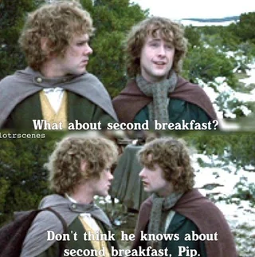
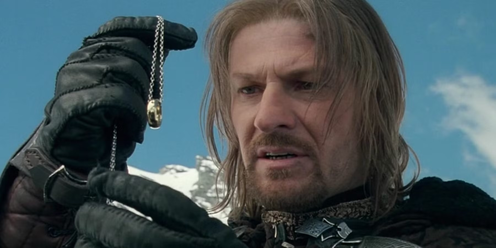

# English Language 3
## Lesson 4
### Units: 87-92 (Comparatives, Superlatives, As...as, Too/Enough)

Prof. Pedro Groppo / DLEM-UFPB

---

## Homework Review: Character Diary Check

**What we're looking for in your "Day in the Life" diaries:**
- Present simple + frequency adverbs: "I **usually** wake **early**"
- Likes/dislikes + -ing: "I **enjoy solving** mysteries **but** hate being interrupted"
- Adverbs of manner: "I work **methodically** through evidence"
- Conjunctions: **but, and, so, because**

**Quick sharing:** Read ONE memorable sentence from your character's diary!

*I wonder what Carrie, Hannibal, and Suzuki Takano were up to...*

---

## Common Diary Corrections

**Typical mistakes we'll fix together:**

❌ "I am usually working carefully"  
✅ "I **usually work carefully**" (frequency adverb position)

❌ "I like to eating people"  
✅ "I **like eating** people" (like + -ing)

❌ "I solve crimes, and I love deduction"  
✅ "I solve crimes **and** I love deduction" (conjunction flow)

**Examples you might have written:**
- "I **usually** experiment **enthusiastically** because science fascinates me" (Peter Parker)
- "I **always** cook **elegantly** and I **enjoy preparing** sophisticated meals" (Hannibal)

---

### Today's Mission: Your Character in Middle-earth

**The Setup:** Your character has been transported to Middle-earth 🙂 during the events of Lord of the Rings! 😓 Compare YOUR character to these Middle-earth legends:

**Our LOTR comparison targets:**
- **Frodo** and **Sam** 🧑‍🌾 - brave but small hobbit heroes
- **Gandalf** 🧙‍♂️ - wise ancient wizard 
- **Aragorn** 🤴- skilled ranger but also a king!
- **Legolas** 🧝‍♂️ - graceful elf archer 
- **Gimli** 👨‍🦰 - tough dwarf warrior 
- **Gollum** 🤢 - corrupted ring-obsessed creature 
- **Boromir** 🧔‍♂️ - proud but flawed human warrior 
- **Sauron** 👁️ - ultimate evil overlord 

---

# Block 1: Comparative Forms
## Units 87-88: Making Direct Comparisons

**Formation Rules - Master These Patterns:**
- **One syllable:** tall → **taller**, brave → **braver**
- **Two+ syllables:** powerful → **more powerful**  
- **-y endings:** heavy → **heavier**, easy → **easier**
- **Irregular:** good → **better**, bad → **worse**, far → **further**

**Essential Structure:** Subject + be + comparative + **than** + object

---

## LOTR Comparative Examples

**Physical & Skill Comparisons:**
- "Aragorn is **taller than** Frodo but **shorter than** Gandalf"
- "Gimli is **stronger than** most elves but **less graceful than** Legolas"
- "Gollum is **more cunning than** he appears but **weaker than** any warrior"
- "Boromir is **braver than** ordinary men but **more impulsive than** Aragorn"

**Common Mistakes to Avoid:**
❌ "more better" → ✅ "better"  
❌ "more stronger" → ✅ "stronger"

---

#### Activity: YOUR Character in Middle-earth

- Sherlock is **more analytical than** Gandalf but **less magical**
- Holmes is **more detail-focused than** Aragorn
- Sherlock is **less diplomatic than** Legolas
- Holmes is **braver than** he appears but **more reckless than** Frodo
- Sherlock is **worse at** teamwork than any Fellowship member

**Your Task:** Compare YOUR character to LOTR heroes
- Compare your character to 3 LOTR characters
- Use 6 different comparative structures
- Include "much/far/a lot + comparative" at least once
- Consider: intelligence, courage, skills, personality, weaknesses

---

# Block 2: Superlatives & Rankings
## Unit 90: Crowning the Champions

**Formation Rules:**
- **One syllable:** the + -est → **the tallest, the bravest**
- **Two+ syllables:** the most → **the most powerful**
- **Irregular:** **the best, the worst, the furthest**

**Context Creates Meaning:**
- "Gandalf is **the wisest** member of the Fellowship"
- "Sauron is **the most evil** being in Middle-earth"
- "Gollum is **the most tragic** character in the story"

---

### Middle-earth Character Awards

- **The bravest heart:** Frodo (carries the Ring despite fear)
- **The most loyal companion:** Samwise Gamgee (never abandons Frodo)
- **The wisest counselor:** Gandalf the Grey (guides everyone)
- **The most skilled archer:** Legolas (never misses a shot)
- **The most tragic figure:** Gollum (corrupted by the Ring)
- **The proudest warrior:** Boromir (leads to his downfall)

**Your Mission:** Create 6 awards mixing YOUR character with LOTR characters
- **The most obsessive character:** Gollum vs Hannibal Lecter (who wins?)
- **The bravest detective:** Sherlock Holmes vs Gandalf
- **The most agile hero:** Spider-Man vs Legolas

---

# 🧙‍♂️ BREAK TIME 🧙‍♂️
## 10 Minutes

---

# Block 3: As...As Comparisons
## Unit 89: Finding Equal Ground

**Key Structures for Equality:**
- **Positive equality:** "Harry Potter is **as brave as** Frodo"
- **Negative equality:** "Hannibal isn't **as trustworthy as** he appears"
- **Emphasis:** "Spider-Man is **just as heroic as** any Fellowship member"

**Subtle Communication Tips:**
"Not as wise as" = less wise (gentler than saying "less wise")

---

## As...As Speed Rounds: Character Crossover

**Round 1: Courage Comparison**
Teacher: "Compare your character's bravery to Frodo's"
Examples:
- "Harry Potter is **as brave as** Frodo when facing Voldemort"
- "Peter Parker is **as willing** to sacrifice **as** Frodo but **not as** burdened"

**Round 2: Intelligence Match-up**
"Sherlock Holmes is **as observant as** Gandalf but **not as** powerful"

**Round 3: Loyalty Test**
"Compare your character's loyalty to Sam's devotion"

**Student Practice:** 90 seconds per round, switch partners

---

# Block 4: Too & Enough Psychology
## Units 91-92: Character Flaws & Strengths

**Essential Concepts:**
- **Too + adjective** = excessive/problematic
- **Adjective + enough** = sufficient/positive
- **Not + adjective + enough** = insufficient

**Position Rules:**
- Enough goes **AFTER** adjectives: "brave enough"
- Enough goes **BEFORE** nouns: "enough courage"

---

### Character Psychology: LOTR Meets Your Hero

**Model - Boromir's Fatal Flaws:**

"Boromir is **too proud** to admit the Ring corrupts him. He's **brave enough** to die protecting hobbits but **not wise enough** to resist temptation. He's **too desperate** to save Gondor to think clearly. He has **enough strength** to fight orcs but **not enough** humility to follow Aragorn's leadership. His love for his people is **too intense** to let him see other solutions."

---

## Your Character's Psychology Profile

**Activity: Character Analysis in Middle-earth Context**

**Your Task:**
- Write 6-8 sentences about YOUR character using too/enough
- Explain how their traits would help/hurt in Middle-earth
- Show both strengths AND problematic qualities

**Example Starters:**
- "Hannibal Lecter is **too sophisticated** for hobbit life but **clever enough** to..."
- "Spider-Man is **young enough** to learn from Gandalf but **too** impulsive to..."
- "Harry Potter is **brave enough** to join the Fellowship but **not experienced enough** to..."

---

### Block 5: Complete Character Integration
#### Your Hero Joins the Fellowship

Present how YOUR character would fit into the Fellowship using **ALL** comparison structures

- Compare them to 2 Fellowship members (comparatives)
- Rank them among the group (superlatives)  
- Show equal/different abilities (as...as)
- Explain what would help/hinder them (too/enough)

**Example**: "If Sherlock Holmes joined the Fellowship, he would be **more analytical than** Boromir but **less patient than** Gandalf. He'd be **the best** at solving puzzles but **the worst** at following orders. He's **as dedicated as** Frodo to his mission but **not as** emotionally stable. He's **too arrogant** to take advice easily but **intelligent enough** to..."

---

## Error Correction: Common Middle-earth Mistakes

**Fix these character comparison errors:**

❌ "Harry is more braver than Boromir"  
✅ "Harry is **braver than** Boromir"

❌ "Hannibal is the most intelligent than Gandalf"  
✅ "Hannibal is **more intelligent than** Gandalf" OR "**the most intelligent** character"

❌ "Spider-Man is too much agile"  
✅ "Spider-Man is **too agile** for Gimli to follow"

❌ "Sherlock observes as good as Legolas shoots"  
✅ "Sherlock observes **as well as** Legolas shoots"

---

## Homework Assignment

**Grammar Practice:**
Complete Units 87.4, 88.3, 89.3-4, 90.3, 91.4, 92.4 from English Grammar in Use

**Writing Task:** "Character in Middle-earth Report" (200 words)
**Imagine:** Your character has spent one month with the Fellowship

- Compare how they've changed vs their original world (comparatives)
- Rank them among Fellowship members in different areas (superlatives)  
- Show what skills/traits stayed equal (as...as)
- Explain adaptation challenges using too/enough
- **Use minimum 15 comparison structures total**

**Speaking Prep:** Practice describing how your character would handle carrying the Ring for next class!

---

# Grammar Mastery Review

**Today's Conquered Structures:**
- **Comparatives:** -er/more + than for direct character comparisons
- **Superlatives:** the -est/most for ranking heroes and villains
- **Equality:** as...as for showing matching abilities  
- **Sufficiency:** enough (after adjectives, before nouns)
- **Excess:** too + adjective for character flaws

**Middle-earth Wisdom:** Use these structures to sound more natural and precise when describing people and situations!

---

# Next Class Preview 

### Coming Up: Articles & Quantifiers - What Does Your Character Carry?

- "Frodo 🧑‍🌾 carries **the** Ring but has **no** sword"
- "Gandalf 🧙‍♂️ has **some** magic but **little** patience for foolishness"
- "Legolas 🧝‍♂️ needs **few** arrows because he never misses"

#### Prep: Preview Units 69-73, 76-77, 83-84 in English Grammar in Use
### Think about what possessions and resources your character would need in Middle-earth 