# English Literature I
## The Canterbury Tales
### The General Prologue, Part 2 (From the Merchant to the Pardoner)

Prof. Pedro Groppo - DLEM/UFPB

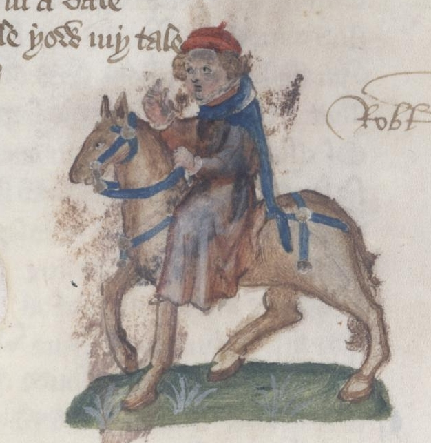

---

## Recap: Medieval System of the Three Estates (Ancien Régime)

| Estate | Function | Ideal |
|--------|--------|-------|
| **Those Who Pray** | Intercede | Parson |
| **Those Who Fight** | Protect | Knight |
| **Those Who Work** | Sustain | Plowman |

New professional classes beyond the three estates

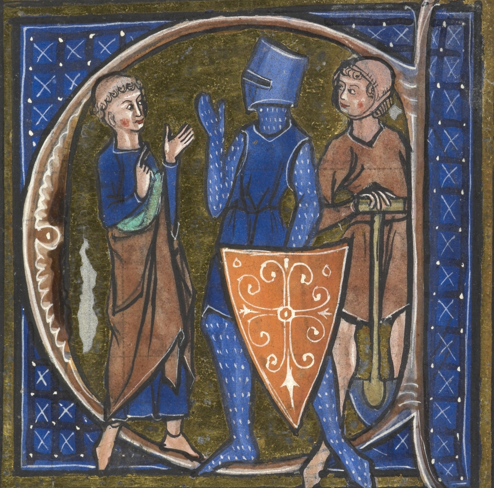

---

## The New Medieval Merchant Class

### Who are these "new rich" of the 14th century:

| Group | Description | Example in the Tales |
|-------|-----------|-------------------|
| **Merchants** | Long-distance traders | The Merchant (wool, wines) |
| **Organized artisans** | Urban corporations (guilds) | The Five Guildsmen |
| **Franklins** | Free rural landowners | The Franklin |
| **Professionals** | Lawyers, doctors, administrators | The Man of Law, The Physician |

| Merchant Class | Aristocracy |
|------------------|--------------|
| **Have money** | **Have hereditary prestige** |
| **Buy land** | **Inherit noble titles** |
| **Economic power** | **Traditional political power** |
| **Pay taxes** | **Privileges and exemptions** |

---

## Chaucer's Moral Hierarchy

### From Most Admired to Most Criticized:

| Position on Scale | Characters | What Chaucer sees in them |
|-------------------|-------------|------------------------|
| **Top of scale** | Knight, Parson, Plowman | Integrity without corruption |
| **Praised** | Clerk, Yeoman, Squire | Genuine, with minor flaws |
| **Respected** | Five guildsmen | Honest and collective work |
| **Moderately criticized** | Specialized professionals | Good at what they do, bad in character |
| **Harshly criticized** | Miller, Reeve, Manciple | Uses talent to steal |
| **Despised** | Summoner, Pardoner | Corrupt what is sacred |

---

## The Merchant (270-284)

```
This worthy man ful wel his wit bisette:
Ther wiste no wight that he was in dette,
So estatly was he of his governaunce
With his bargaynes and with his chevyssaunce.
```
- Characterized by his fashionable attire and outward appearance
- Primarily concerned with increasing profits
- Involved with illegal exchange of currency
- Apparent success but possibly in debt

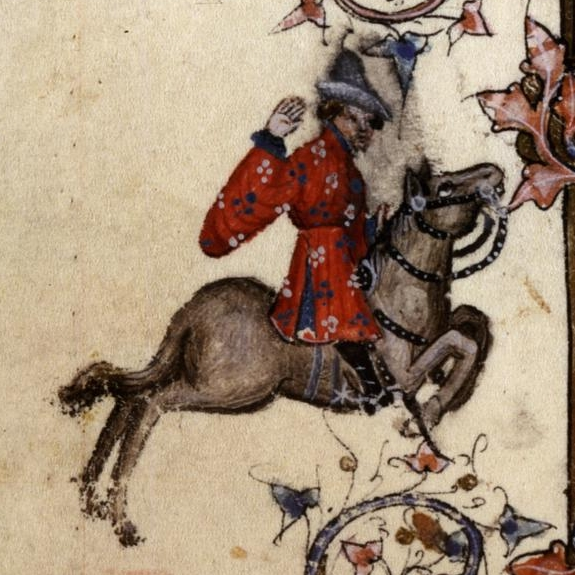

---

## The Clerk (285-308)

```
For hym was levere have at his beddes heed
Twenty bookes, clad in blak or reed,
Of Aristotle and his philosophie
Than robes riche, or fithele, or gay sautrie.
```

- Archetypal impoverished scholar, devoted to logic and philosophy, not material wealth
- Appearance: thin, threadbare clothes
- Refuses to serve the world (secular office), only speaks when necessary
- Social equal with the Merchant, Sergeant of the Law, etc.
- More of an ideal: contrast with the Monk and the Physician

.jpg)

---

## The Sergeant of the Law (309-330)

```
Therto he koude endite and make a thyng,
Ther koude no wight pynche at his writyng;
And every statut koude he pleyn by rote
```

- Highly proficient and high-ranking figure within the legal profession
- Role: administration of the law, responsibility he shares with the Franklin, whom he rides in company
- Despite his apperance of wisdom, narrator suggests his primary aim is financial gain
- Less busy than he pretends to be

.jpg)

---

## The Franklin (331-360)

```
To lyven in delit was evere his wone,
For he was Epicurus owene sone,
That heeld opinioun that pleyn delit
Was verray felicitee parfit.
```

- A wealthy, hospitable, and respected landowner who embodies the ideal of generous, pleasureable living
- Renowned as an extraordinary host, compared to Saint Julian, the patron saint of hospitality
- Status that borders on the minor gentry and reflects a desire for upward social mobility

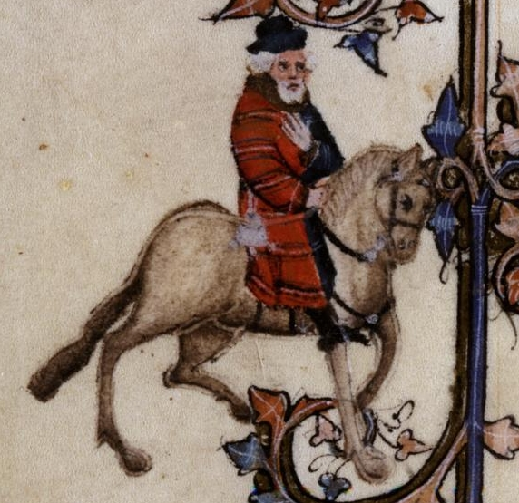

---

## The Five Guildsmen - Haberdasher, Carpenter, Weaver, Dyer, Tapestry-maker (361-378)

```
And they were clothed alle in o lyveree
Of a solempne and a greet fraternitee.
Ful fressh and newe hir geere apiked was;
Hir knyves were chaped noght with bras
But al with silver, wroght ful clene and weel,
```

- Prosperous members of the rising middle class, focused on social advancement and material prosperity
- Belong to a large parish guild, dressed in matching clothing of the guild
- Considered `shaply for to been an alderman`, suitable for holding a high civic office, reflecting their aspirations for public recognition and political influence
- They have new and polished silver tools, and bring along a Cook -- desire to distinguish themselves from other pilgrims

---

## The Cook (379-387)

```
But greet harm was it, as it thoughte me,
That on his shyne a mormal hadde he.
For blankmanger, that made he with the beste.
```
- Defined primarily by his extensive culinary abilities
- Most notable detail about the Cook is the open sore on his shin: probably from veneral disease
- The ulcer makes the food "nauseating" due to concerns of hygiene, rather than explicit sin

.jpg)

---

## The Shipman (388-410)

```
If that he faught and hadde the hyer hond,
By water he sente hem hoom to every lond.
```
- Contrasts his professional competence and his significant moral failings
- Is a fine seaman and professionally very competent, with extensive geographical knowledge
- Is an expert in understanding of tides, currents, and navigational challenges
- Marked by thievery, piracy, and mass murder - often disguised by euphemistic metaphor

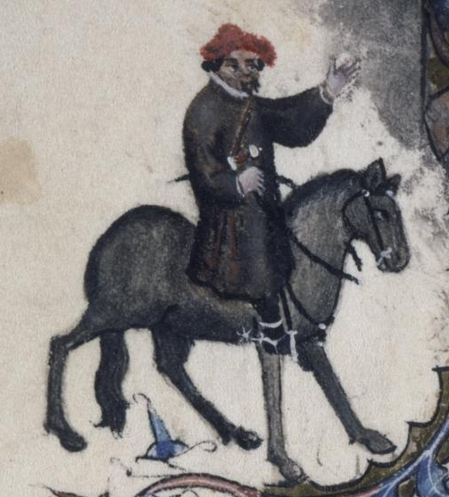

---

## The Physician (411-444)

```
He was a verray, parfit praktisour:
The cause yknowe, and of his harm the roote,
Anon he yaf the sike man his boote.
(...)
For gold in phisik is a cordial,
Therefore he lovede gold in special.
```

- Again, a contrast between professional competence and significant moral shortcomings
- Practice well-grounded in astrology (accepted practice at the time)
- Primary motivation: profit. `boote` means remedy, not necessarily "cure"
- Hardly ever reads the Bible

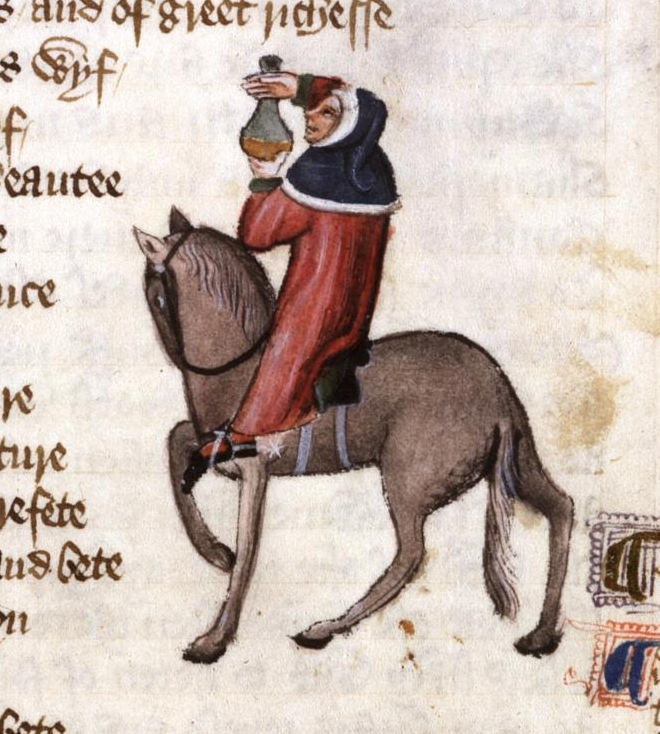

---

## Medieval Medicine - Theory of Humors

```
He knew the cause of everich maladye,
Were it of hoot, or coold, or moyste, or drye,
And where they engendred, and of what humour.
```

| Humor | Element | Qualities | Temperament | Characteristics |
|-------|----------|------------|--------------|----------------|
| **Blood** | Air | Hot and moist | Sanguine | Cheerful, brave, red |
| **Phlegm** | Water | Cold and moist | Phlegmatic | Calm, slow, pale |
| **Yellow bile** | Fire | Hot and dry | Choleric | Irritated, thin, yellowish |
| **Black bile** | Earth | Cold and dry | Melancholic | Sad, thoughtful, dark |

- Health was the perfect balance between the four humors. Disease would indicate the excess or lack of some humor.
- Some treatments were to restore the balance (e.g. bloodletting, purgatives)

---

## The Wife of Bath (445-476)

```
Upon an amblere esily she sat,
Ywympled wel, and on hir heed an hat
As brood as is a bokeler or a targe;
A foot-mantel aboute hir hipes large,
 And on hir feet a paire of spores sharpe.
```

- Larger than life portrait; emphasizes her professional prowess and unconventional views on marriage, love, and female agency
- Somewhat deaf (later developed in her tale), but here indicates she prefers speaking rather than listening, and her loud voice
- Striking appearance, exaggerated

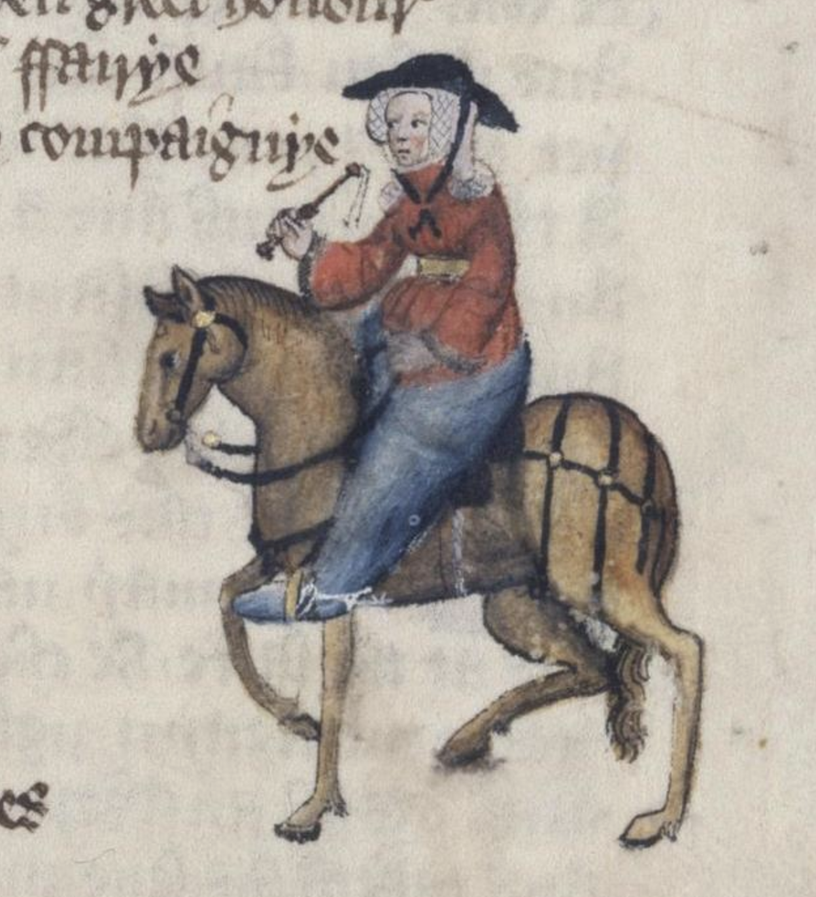

---

## The Wife of Bath (445-476)

```
She was a worthy womman al hir lyve:
Housbondes at chirche dore she hadde fyve
```

- Women often treated as a separate "estate", but the wife gives women a high profile
- An experienced cloth-maker by occupation, but clearly matrimony is her "main profession"
- The idea of a young woman cuckolding her old husband is noted as a source of entertainment in medieval society
- Her motives for pilgrimage are implied to be "less pure" than the Knight's, as wives proverbially used pilgrimages as a cover for other activities

```
In felaweshipe wel koude she laughe and carpe.
Of remedies of love she knew per chaunce,
For she koude of that art the olde daunce.
```
---

## The Parson (477-528)

```
And was a povre PERSOUN OF A TOUN,
But riche he was of hooly thoght and werk.
```
- Model of Christian piety and an ideal clergyman, contrasted with the moral failings of other pilgrims
- A "true physician" in a spiritual sense, one who visits the sick and tends properly to the cure of souls
- Embodies the principle: `first he wroghte, and afterward he taughte.`
- Preaches, teaches and lives by the standards of the Gospel texts he refers to

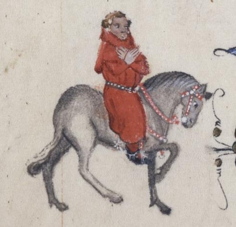

---
## The Parson (477-528)

- Metaphor: `if gold ruste, what shal iren do?` (compare with the gold from the Physician and the Monk)
- Refuses to extract **tithes** through threats of **excommunication**, preferring instead to share church collections and his personal wealth with the poor
- Metaphor: shepherds, sheep, wolves: `He was a shepherde and noght a mercenarie.`
- Not an "absentee" priest, or "rent out his parish" for personal gain in lucrative London positions
- Remains steadfast at his post, diligently guarding his flock from moral "wolves"
- Almost no physical description of the Parson: focuses instead on his spiritual and moral qualities
- Implicit critique of the corrupt clergy of the time

---

## The Plowman (529-541)

```
God loved he best with al his hole herte 
At alle tymes, thogh him gamed or smerte,
And thanne his neighebour right as himselve.
```

- An ideal and exemplary figure, representing the best of the laboring class and embodying true Christian charity and humility
- Described as an "honest and good" man, "living in peace and practicing charity"
- In post-Black Death England, workers demanded high wages; this plowman works `withouten hire` out of Christian love, helps the poor and pays tithes
- The Plowman is the Parson's brother: the ideals of Christian duty, which come by nature to him. 
- Harmonious link between the shepherd of souls (the Parson) with the tiller of the soil (the Plowman), bridging the sacred and secular realms

---

## The Miller (545-566)

```
Upon the cop right of his nose he hade 
A werte, and theron stood a tuft of herys, 
Reed as the bristles of a sowes erys; 
His nosethirles blake were and wyde (554-557)
```

- Represents the less savory aspects of the laboring class, particularly their dishonesty
- Giant of a man, known for his brute strength, capable of breaking down doors with his head
- Appearance depicted in a grotesque close-up
- In medieval physiognomy, red hair indicated anger, lust, while a large mouth meant gluttony and boldness

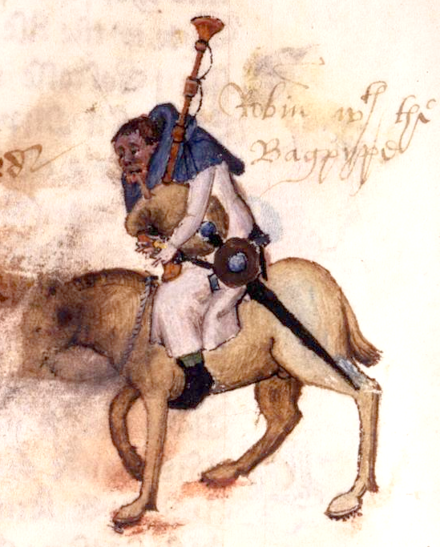

---

## The Miller (545-566)

```
Wel coude he stelen corn, and tollen thryes,
And yet he hadde a thombe of gold, pardee.
```

- His professional expertise is defined solely in terms of thievery
- Proverb about honest millers having "golden thumbs", implying his thumb is "golden" from the literal gold he acquires through dishonest means
- Plays the bagpipes with enthusiasm, the rustic instrument's noise is deemed appropriate for him
- Almost no physical description for the virtuous Parson and Plowman, but for the Miller, a detailed and repelling physical description, focusing on his flaws
- Represents one of the figures of the "those who labour" estate in medieval society; also one of the "**rascals**" along with the Manciple, Reeve, Summoner and Pardoner

---

## The Manciple (567-586)

```
Now is nat that of God a ful fair grace
That swich a lewed mannes wit shal pace
The wisdom of an heep of lerned men?
```

- Highly shrewd and financially astute, manages the provisions for a London law school
- Professional expertise defined by his outstanding financial acumen
- Described as being capable of outmaneuvering the legal experts
- No mention of his physical appearance, his horse, his temperament, his conversation, or his desires and morality

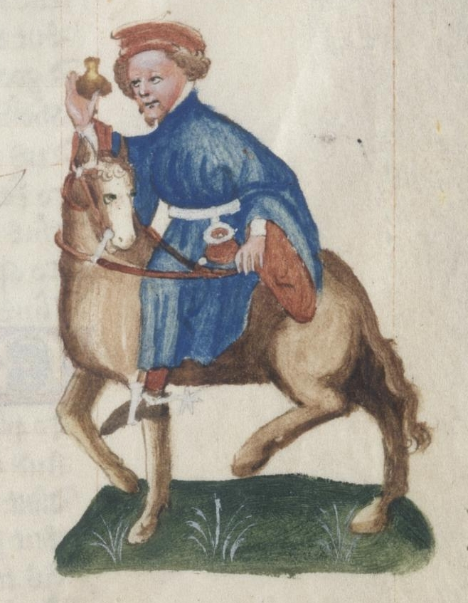

---

## The Reeve (587-622)

```
His lord wel koude he plesen subtilly,
To yeve and lene hym of his owene good,
And have a thank, and yet a cote and hood.
```
- The Reeve is a feudal property manager, an overseer of a lord's estate 
- Master of overseeing and managing his lord's lands, capable of outclassing any auditor
- The Reeve and the Miller are depicted as rivals: The Miller aims to cheat everyone, while the Reeve's role is to "outwit fraud"
- Later they will quarrel over whose tale of a carpenter would be told

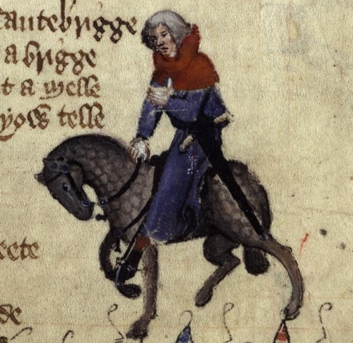

---

## The Summoner (623-668)

```
As hoot he was and lecherous as a sparwe,
With scalled browes blake and piled berd.
Of his visage children were aferd.
```
- A highly corrupt and physically repulsive ecclesiastical officer (summons people to the church courts, functioning as an instrument of divine justice)
- He has a "fire-red cherubim's face" covered in pustules, with black scabious eyelashes and a very thin beard
- Possibly a form of leprosy linked to unclean living, suggesting inner corruption but outright sin

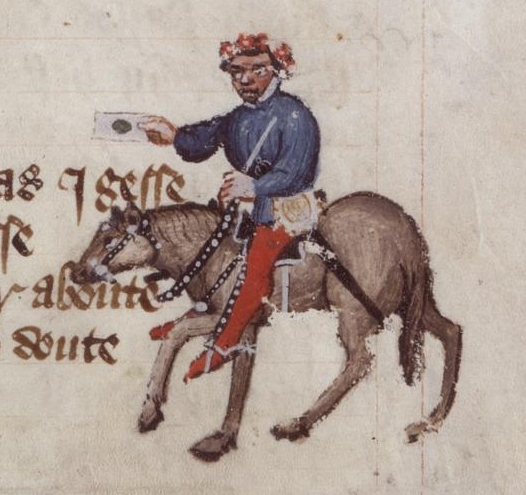

---

## The Summoner (623-668)

- He inverts the true function of his office, using it to collude with and profit from the very offenses he is supposed to suppress
- Despite his limited Latin, he constantly repeats "Questio quid juris" (The question is: what part of the law applies?)
- So corrupt that for a quarter-gallon of wine, he would allow a man to keep a concubine for a year without reporting him to the ecclesiastical court, and secretly engaged in such activities himself
- His effeminate appearance and his singing `Com hider, love, to me!` with the Pardoner suggest sexual deviancy, possibly homosexuality or bisexuality
- They are depicted as "inherent enemies" in medieval estates satire, representing a distorted complementary relationship between divine justice (Summoner) and divine mercy/love (Pardoner)
- Compare with the other pairings (e.g. Parson and Plowman)

---
## Physical Appearance

| **The Divine (Cherub)** | **The Corrupt (Pustules)** |
|-------------------------|------------------------------|
| Angelic purity | Venereal diseases |
| Celestial beauty | Grotesque deformity |
| Closeness to God | Carnal sin |

- **Beauty = Moral goodness** / **Grotesque = Spiritual corruption**
- Physical appearance **reveals** the state of the soul
- Pustules symbolize **internal moral putrefaction**

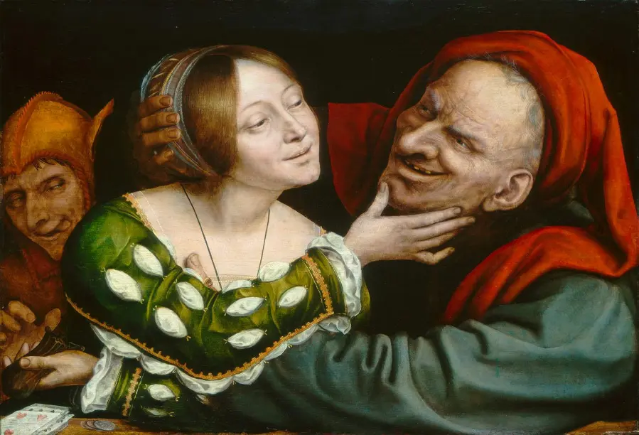

---

## The Pardoner (669-714)

- Sells papal indulgences and religious relics to raise money, often using false relics and deceptions to profit from people's faith
- Has waxy yellow hair, his eyes bulge like a hare's, and he has a thin, high voice like a goat. Face is smooth as if recently shaved
- Raises questions about his sexual identity: 
  - `I trowe he were a geldyng or a mare` implying. effeminacy or sexual deviancy, possibly a eunuch 

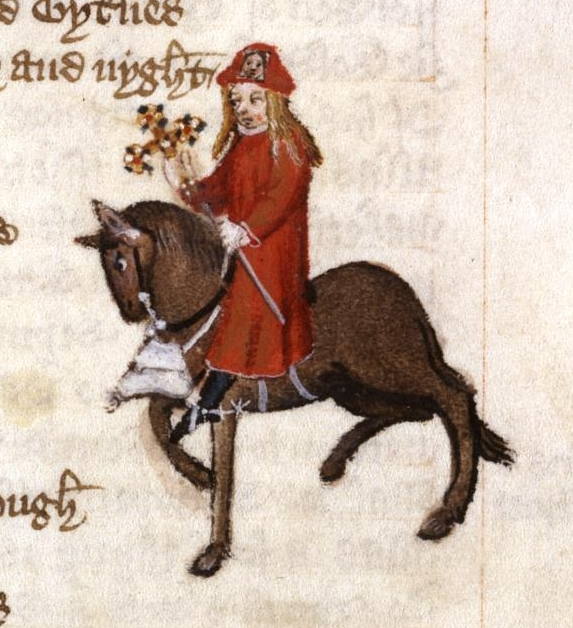

---

## The Pardoner (669-714)

- He inverts the true function of his office: instead of helping people towards salvation and truth, he is entirely focused on fraud
- Claims powers of absolution that theological doctrine reserved to God
- Carries forged indulgences, which he advertises as `from Rome al hoot`
- Effective at his deceptive work, boasting he can collect more money in one day than a poor parson earns in two months, his life goal being `to wynne silver`
- Sells fake relics: a pillow-case he claims is the Virgin Mary's veil, a piece of the sail from St. Peter's boat, a brass cross embedded with fake stones, and pig bones
- Uses `feyned flaterye and japes` to make both the parish priest and the common people his `apes`
- When he is in church, described as a `noble ecclesiaste`, capable of reading lessons, telling stories, and singing the offertory exceptionally well because he knows this is when he can sharpen his tongue to collect as much money as possible

---

## Chaucer the Pilgrim's Narrative Methodology (714-746)

```
Crist spak hymself ful brode in hooly writ,
And wel ye woot no vileynye is it.
Eek Plato seith, whoso kan hym rede,
The wordes moote be cosyn to the dede.
```
- The narrator justifies his use of frank and direct language
- A faithful reporter has an obligation to reproduce the words and actions of his companions exactly as they were, even if they are coarse or indecent
- Failing to do so would result in a fictionalized account that deviates from reality
- Appeals to Christ, who used frank language in the Holy Scriptures, and Plato, who stated that "words should be twins of the act"
- Thus the characters **condemn themselves** - hypocrisy is exposed through their **own words**

---

## The Host (Harry Bailly) and the Contest (747-768)

- A real historical person of considerable distinction in London during the 1380s, owner of the Tabard Inn in Southwark
- Suggests the idea of each pilgrim telling two tales on the way to Canterbury and two on the way back to make the journey more entertaining
- Offers a free supper at the Tabard Inn as a prize for the pilgrim who tells the story with the `best sentence and moost solaas` (best meaning and most amusement)
- This reveals the medieval function of literature: **docere et delectare** (to educate and to give pleasure)
- Assumes the role of guide, judge, and marker of the stories, joining the company at his own expense
- To start the contest, he has the pilgrims draw straws, with the Knight drawing the shortest straw and thus going first

---

## References

CHAUCER, Geoffrey. *The Canterbury Tales*. London: Norton, 2012.
COOPER, Helen. *The Oxford Guide to the Canterbury Tales*. Oxford: Oxford UP, 2020.