# English Literature V
## Introduction to English and Irish Literature
### Historical and Social Background - Early 20th Century (1890-1930)

Pedro Groppo - DLEM/UFPB

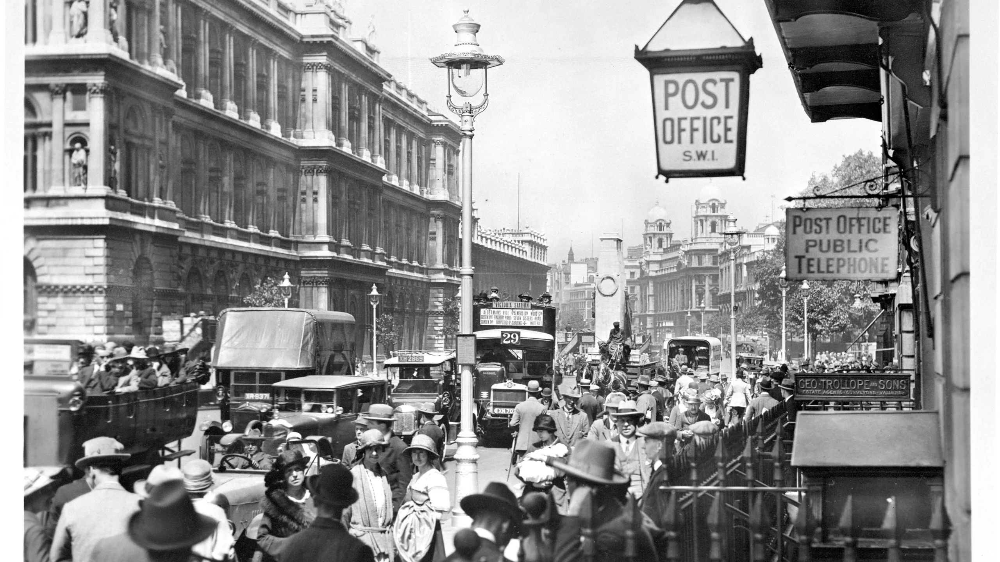

---

# HISTORICAL AND SOCIAL BACKGROUND

## Victorian Certainties vs. Modern Uncertainties

| **Victorian World (1837-1901)** | **Modern World (1890-1920)** |
|----------------------------------|-------------------------------|
| **God** watches over everything | **Nietzsche**: "God is dead" |
| **Absolute truth** exists | **Nietzsche**: No truths, only interpretations |
| **Progress** is inevitable | **World War I** shows civilization's barbarism |
| **Reason** solves all problems | **Freud**: Unconscious drives control behavior |
| **Empire** proves British superiority | **Colonial resistance** questions imperial right |
| **Social order** is natural | **Class conflict** threatens stability |
| **Humans** are special, created by God | **Darwin** shows humans are just animals |
| **Communication** takes days/weeks | **Telegraph/telephone** = instant connection |

**Freud's insight:** Humans are not "master in their own house" - unconscious drives control behavior

---

# Modern, Modernism, and Modernity: Key Distinctions

| **Term** | **Definition** | **Literary Relevance** |
|----------|----------------|------------------------|
| **MODERN** | "Of the present time" - simply contemporary | What we call current literature, technology, life |
| **MODERNITY** | Historical condition: "socio-cultural norms, attitudes and practices that arose in the wake of the Renaissance"  | **Writers respond to:** industrialization, urbanization, mass society, loss of traditional certainties |
| **MODERNISM** | "A break with the past and the concurrent search for new forms of expression"  (Britannica: "Modernism") | **Writers respond with:** stream of consciousness, fragmentation, experimental techniques |

**The Relationship:** Modernist writers use new literary techniques to capture the experience of living in modernity

**Example:** Joyce uses **modernist** stream of consciousness to show how **modern** urban people experience **modernity's** psychological fragmentation

---

# Baudelaire and Modernity ("The Painter of Modern Life", 1863)

> *Modernity is the transient, the fleeting, the contingent; it is one half of art, the other being the eternal and the immovable.*

- The experience of constant change in modern urban life - crowds, fashion, the ephemeral moment

- **The artist's task** is "to extract from fashion whatever element it may contain of poetry within history, to distill the eternal from the transitory"


---

.jpg)
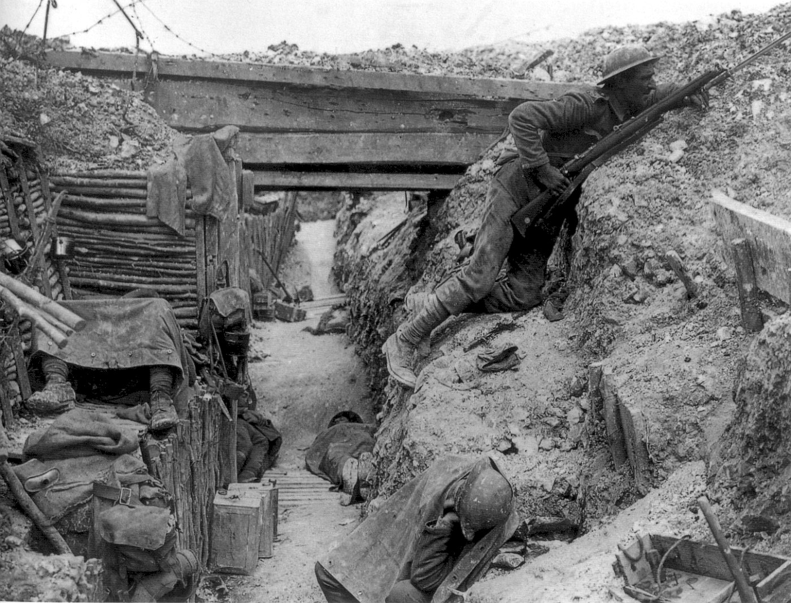

---

## The Speed Revolution

```
1850s ────────────────────────────────────────► 1900s
SLOW                                              FAST

Letters: 2-3 days ──────────────► Telegraph: Instant
News: Weeks/months ─────────────► Daily newspapers  
Photography: Rare/formal ──────► Portable cameras
Entertainment: Live only ──────► Cinema + Radio
Travel: Horse/weeks ───────────► Railway/hours
```

---
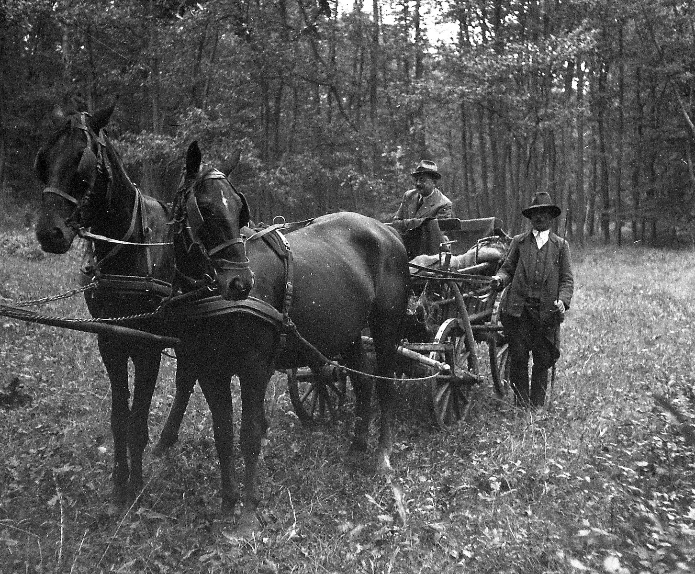
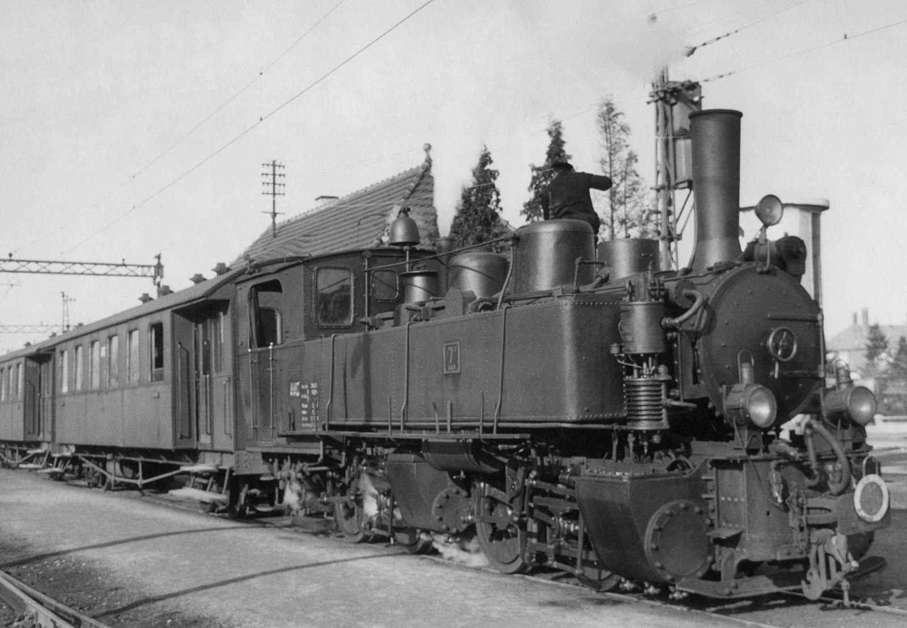
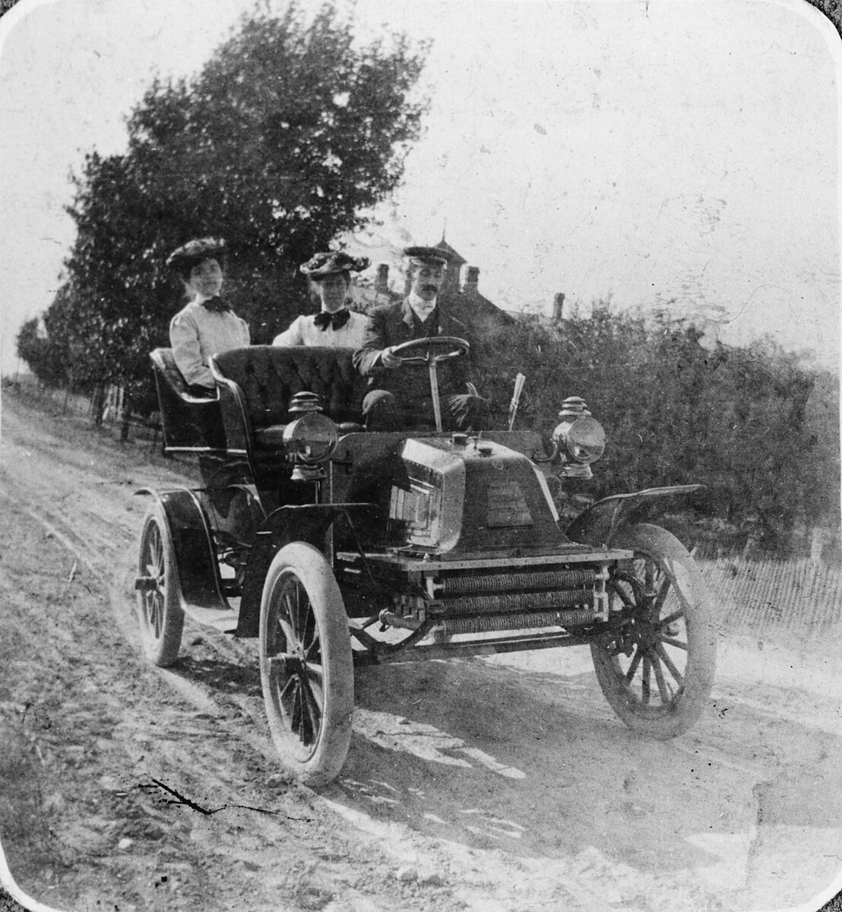

---

.jpg)
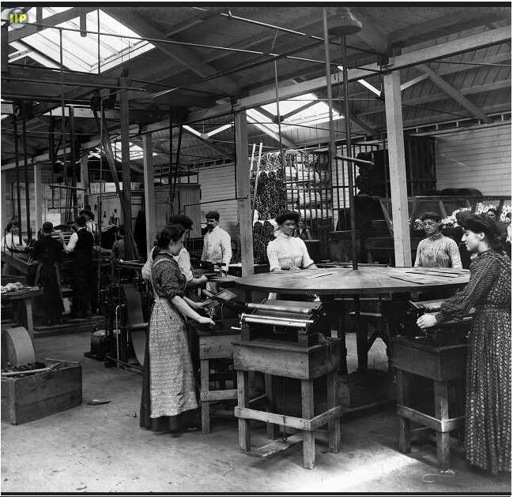

---

## Industrial Revolution: Country vs. City


| **Pre-industrial (1800)** | **Industrial (1900)** |
|---------------------------|------------------------|
| 80% rural | 80% urban |
| Everyone knows everyone | Anonymous crowds |
| Travel by horse | Railroad speed |
| Work follows seasons | Factory clocks |
| Extended families | Nuclear families |
| Tight communities | Isolation |


**Psychological impact**: Anonymity, speed, alienation, class tension


---

## The British Empire: Scale and Anxiety

| **Imperial Scale** | **Cultural Impact** |
|-------------------|---------------------|
| **Largest empire in history** | English becomes global language of power |
| **25% of world's land and population** | Wealth from colonies funds British culture |
| **"Sun never sets" - every continent** | Constant fear of rebellion and decline |

**Why This Matters for Literature:**
- **Identity crisis**: What does "British" mean when ruling 400+ million non-British people?
- **Imperial anxiety**: Literature reflects fears of loss of control and cultural decline
- **Global English**: Colonial experience shapes how English literature develops

---

.jpg)

---

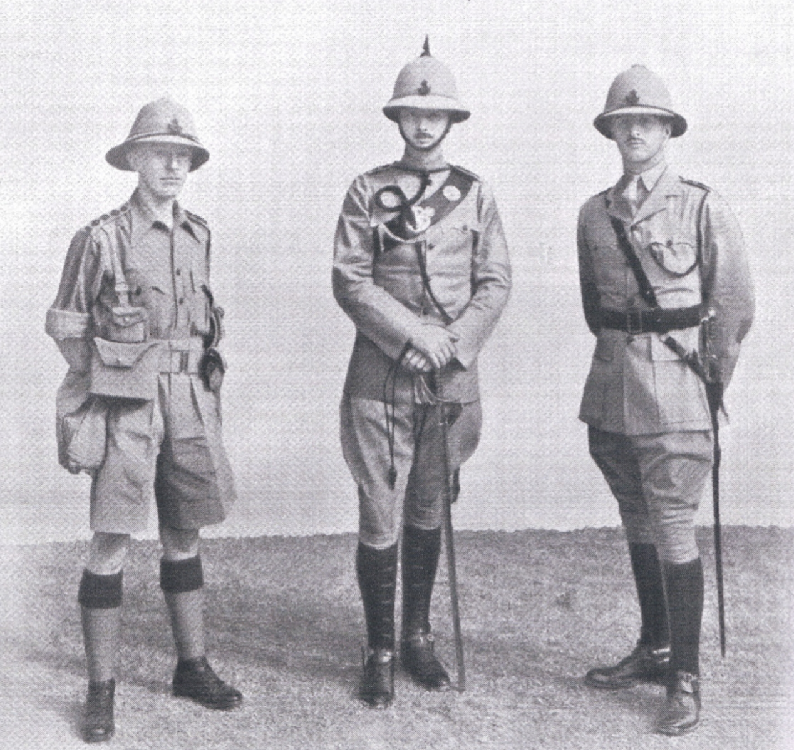


**How the British saw themselves:**

- Believed their Anglo-Saxon race was naturally superior
- Had a moral duty to spread Christianity and "civilization" to "primitive" peoples ("White Man's Burden")
- Upper classes were born to rule both at home and in colonies
- "Stiff upper lip" = emotional restraint and duty over personal desires.
- Colonies existed primarily to serve British economic interests, providing raw materials while buying British manufactured goods.
- Some literature romanticized colonial missions and reinforced class and racial hierarchies.

---

## Ireland: Cultural Suppression and Literary Response

| **Colonial Control** | **Cultural Impact** |
|---------------------|---------------------|
| **700+ years of control** | Irish Gaelic nearly extinct by 1900 |
| **Direct rule from London** | Traditional practices and customs banned |
| **Economic exploitation & famine** | Mass starvation and forced emigration |
| **Educational control** | Identity crisis: neither fully Irish nor English |

**Literary Consequence**: Irish writers like Joyce, Yeats, and others develop new techniques to express cultural displacement and fragmented identity

---

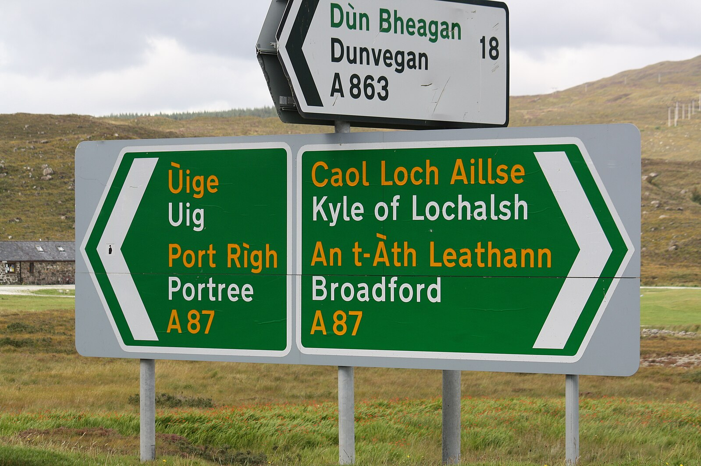

---

## The Great War (1914-1919)


| **Traditional War Poetry (Before 1914)** | **World War I Reality (1914-1918)** |
|-------------------------------------------|-------------------------------------|
| Individual soldiers, personal combat | **Machine guns**: 600 rounds/minute kill hundreds instantly |
| Cavalry charges, skill and courage matter | **Artillery**: Death from miles away, totally random |
| Honor determines survival | **Poison gas**: Science becomes murder weapon |
| Clear enemies, face-to-face fighting | **Trenches**: 25,000 miles of industrial death landscape |
| Noble sacrifice for country | **Scale**: 10 million dead, entire generation wiped out |
| "Dulce et decorum est pro patria mori" | **Speed**: 60,000 British casualties in one day (Somme) |

- Traditional heroic language becomes meaningless - new forms needed to represent unprecedented horror
- Comparison: "The Soldier" vs. "Dulce et Decorum Est"

---

**Excerpt from Wilfred Owen's "Dulce et Decorum Est":**

> *If you could hear, at every jolt, the blood  
> Come gargling from the froth-corrupted lungs...  
> My friend, you would not tell with such high zest  
> To children ardent for some desperate glory,  
> The old Lie: Dulce et decorum est  
> Pro patria mori.*

Latin: "it is sweet and fitting to die for one's country"

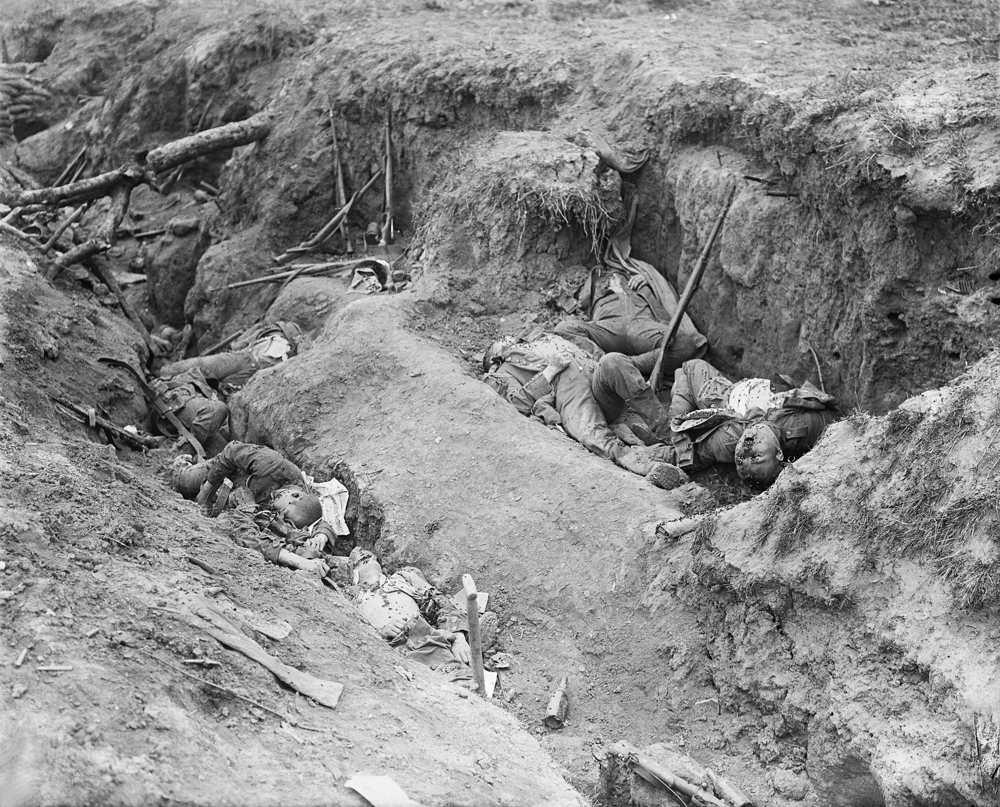

---

## Stream of Consciousness vs. Traditional Narration

**Victorian/Realist - George Eliot, *Middlemarch* (1871-72)**:
> Miss Brooke had that kind of beauty which seems to be thrown into relief by poor dress. Her hand and wrist were so finely formed that she could wear sleeves not less bare of style than those in which the Blessed Virgin appeared to Italian painters; and her profile as well as her stature and bearing seemed to gain the more dignity from her plain garments, which by the side of provincial fashion gave her the impressiveness of a fine quotation from the Bible,—or from one of our elder poets,—in a paragraph of to-day's newspaper. She was usually spoken of as being remarkably clever, but with the addition that her sister Celia had more common-sense.

- Opening sentences introducing Dorothea Brooke through external description. The omniscient narrator describes her physical appearance (beauty enhanced by plain dress), makes cultural comparisons (religious art, biblical quotations), and notes how others perceive her intelligence versus her sister's practicality.

---

**Modernist - James Joyce, *Ulysses* (1922)**

> Ineluctable modality of the visible: at least that if no more, thought through my eyes. Signatures of all things I am here to read, seaspawn and seawrack, the nearing tide, that rusty boot. Snotgreen, bluesilver, rust: coloured signs. Limits of the diaphane. But he adds: in bodies. Then he was aware of them bodies before of them coloured. How? By knocking his sconce against them, sure. Go easy. Bald he was and a millionaire, maestro di color che sanno. Limit of the diaphane in. Why in? Diaphane, adiaphane. If you can put your five fingers through it it is a gate, if not a door. Shut your eyes and see.

- From the "Proteus" episode early in the novel (page 31), where Stephen Dedalus walks alone on a beach in Dublin, lost in philosophical thoughts about perception and reality. His mind jumps between Aristotelian philosophy, what he sees on the beach (seaweed, a boot), and abstract concepts about how we know the physical world through our senses.

---

## Victorian vs. Modernist: Narrative Techniques

| **Element** | **Victorian Literature** | **Modernist Literature** |
|-------------|---------------------------|---------------------------|
| **Narrative Voice** | Omniscient narrator describes and explains | Character's consciousness flows directly |
| **Sentence Structure** | Complex, balanced, complete thoughts | Fragmented, associative, incomplete |
| **Focus** | External description and social context | Internal thought processes and perception |
| **Language** | Formal, literary, publicly shared discourse | Colloquial, philosophical, private mental language |
| **Reader's Work** | Follow narrator's guidance and interpretation | Piece together meaning from mental fragments |
| **Time** | Present moment described from outside | Immediate experience as it happens in mind |
| **Cultural References** | Shared (Bible, art, poetry) for social positioning | Specialized (philosophy) for individual thinking |

---

# Point of View Transformation


| **Traditional** | **Transitional** | **Modernist** |
|-----------------|------------------|---------------|
| **Omniscient Narrator** | **Limited Perspective** | **Stream of Consciousness** |
| Many Victorian novels | Late Victorian/early modernist | Modernist innovatio) |
| Knows everything | Shows uncertainty | Direct thoughts |
| Reliable information | Unreliable narrators | Multiple voices |
| Linear time | Fragmented time | Psychological time |
| External observation | Limited access | Interior consciousness |

**Note**: Victorian fiction uses various techniques - omniscient narration is common but not universal. Some Victorian novels already experiment with limited perspective and unreliable narrators.

---

# In Poetry: Fragmentation and Juxtaposition

## Example: Ezra Pound's "In a Station of the Metro" (1913)

```
The apparition of these faces in the crowd;
Petals on a wet, black bough.
```

**Two images juxtaposed** without explanation - reader must find the connection between urban faces and natural petals.

- **Imagist technique:** "Direct treatment of the thing" - present clear, hard images without explanation or sentiment


---

# AUTHORS AND TEXTS

## Essential Modernist Authors

### Pictured: James Joyce

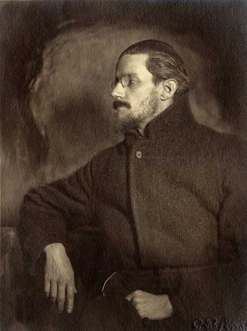


---

**William Butler Yeats (1865-1939)**:
- Greatest Irish poet of 20th century
- Combined Irish mythology with modernist symbolism
- **"The Second Coming" (1919):** "Things fall apart; the centre cannot hold" - captures post-WWI anxiety
- **Technique:** Moved from dreamy Romanticism to stark, symbolic modernism
- Works: "Leda and the Swan", "Easter 1916", "Sailing to Byzantium", "Among Schoolchildren"

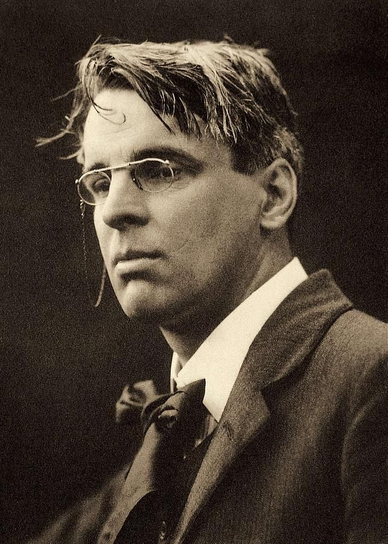

---

**T.S. Eliot (1888-1965)**:
- American-born, London-based - archetypal modernist outsider
- **"The Waste Land" (1922):** Revolutionary fragmented narrative showing post-war spiritual emptiness
- **Technique:** Literary allusions, multiple voices, broken images reflecting broken civilization
- **"Prufrock" (1915):** Created modern anti-hero - paralyzed, self-conscious urban man
- Diagnosed modern condition as spiritual desert needing renewal
- Works: "The Love Song of J. Alfred Prufrock", *The Waste Land*, *Four Quartets*

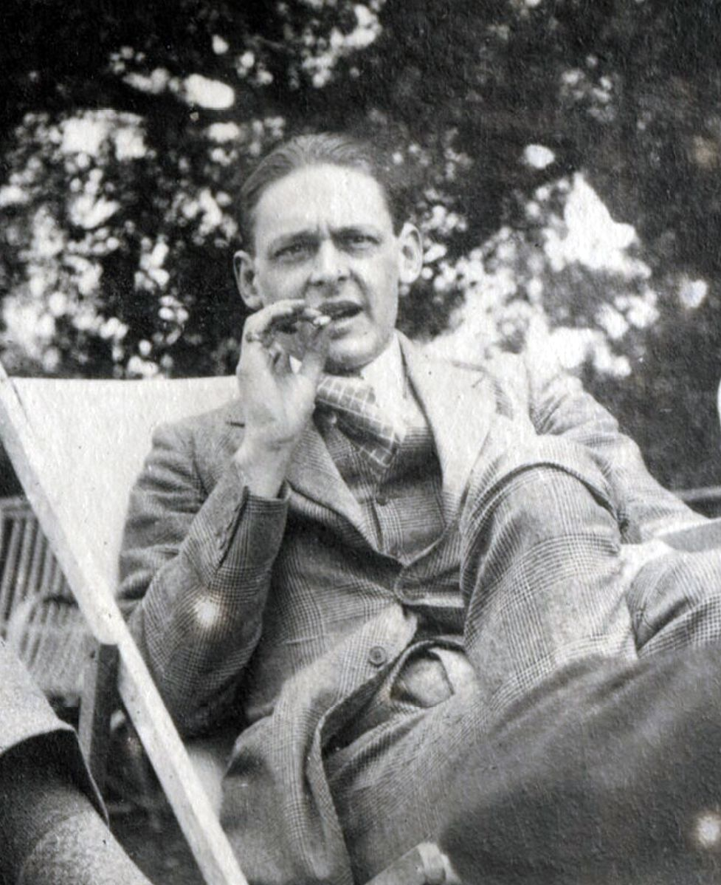

---

**Virginia Woolf (1882-1941)**
- **Technique:** Abandons plot for consciousness flow, poetic prose, internal time vs. clock time
- **Feminist innovation:** *A Room of One's Own* - women excluded from economic independence and education
- **Literary theory:** Attacked "crude characterization," wanted to capture "luminous halo" of consciousness ("Modern Fiction" essay)
- Major works: *Mrs. Dalloway*, *To the Lighthouse*, *The Waves*

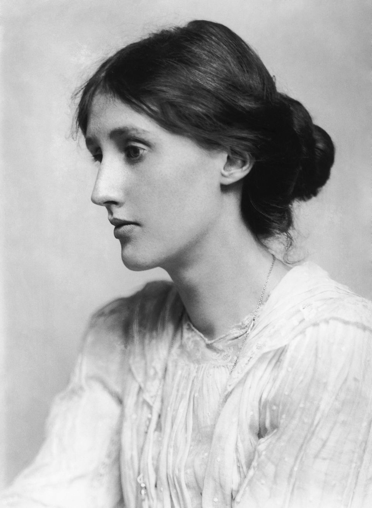

---

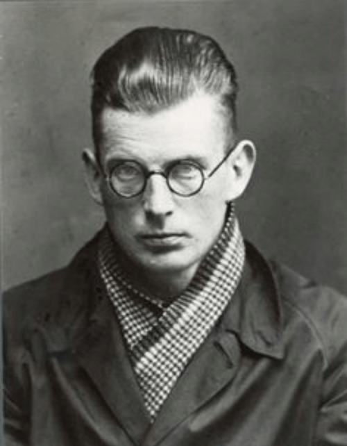

**Samuel Beckett (1906-1989)**:
- Irish playwright and novelist, lived in France
- **Theatre of the Absurd:** Plays where logic breaks down, life seems meaningless
- **"Waiting for Godot" (1952):** Two tramps wait for someone who never comes - existential anxiety made theatrical
- **Technique:** Stripped language to bare essentials, eliminated traditional plot
- **Post-war vision:** Writing after Holocaust and nuclear threat - civilization reduced to fragments
- Works: *Molloy*, *The Unnameable*, *Endgame*

---

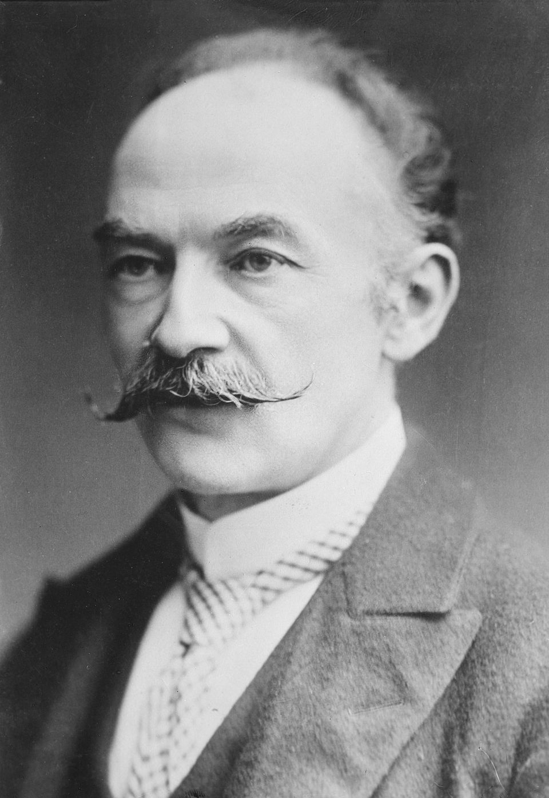

## Authors We'll Be Reading

**Thomas Hardy (1840-1928)**
- Last great Victorian who lived into modern era, died year before Wall Street Crash
- **"On the Western Circuit" (1891):** Letters enable deception, class barriers through literacy
- **Technique:** Still omniscient narrator but questioning moral certainties, self-conscious prose
- **Anticipates modernism:** Characters trapped by forces beyond control, social institutions crumbling
- Major works: *Tess of the D'urbervilles*, *Jude the Obscure*, *The Mayor of Casterbridge*

---

**D.H. Lawrence (1885-1930)**
- Transitions from Victorian realism to modernist techniques
- **"Odour of Chrysanthemums":** A wife's awakening to the reality of her marriage when her husband dies in a mining accident
- **Technique:** Third-person narration with interior focus, rich symbolism
- Narrative through free indirect discourse while maintaining narrative clarity
- Other works: "Sons and Lovers", "Women in Love", "The Rainbow"

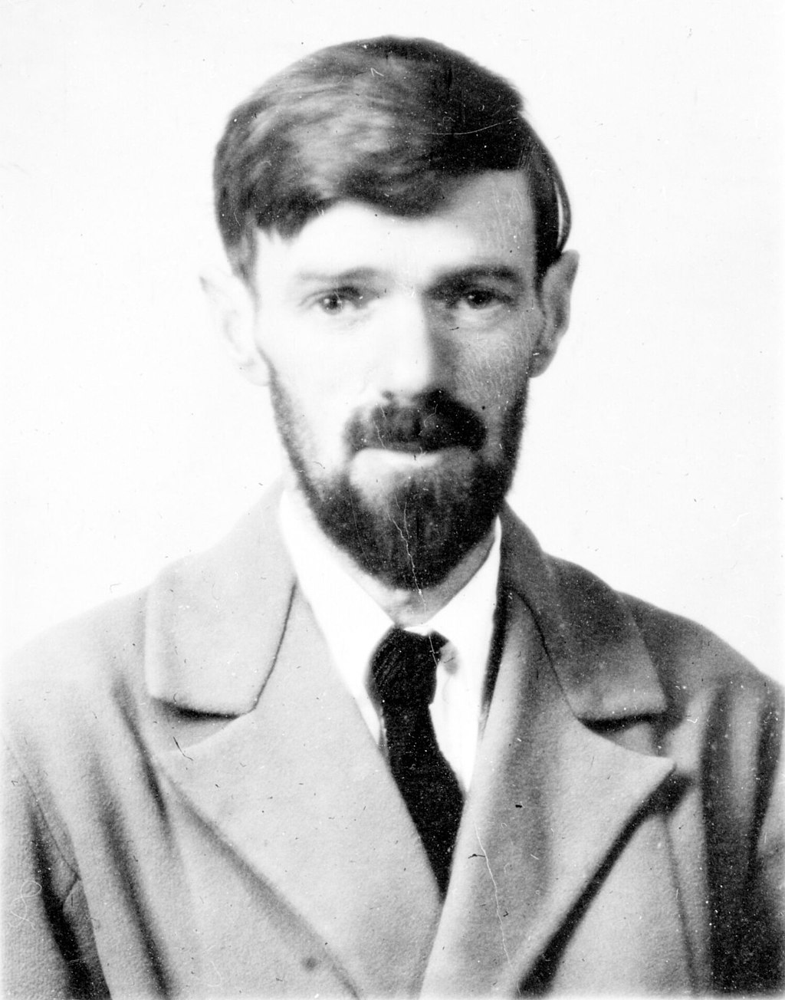

---

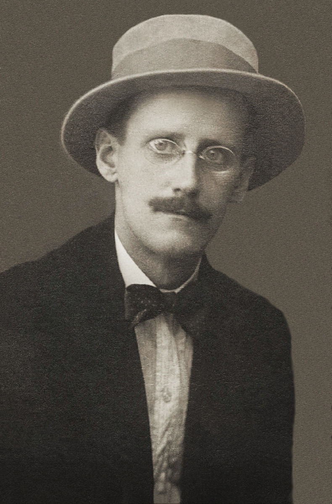

**James Joyce (1882-1941)**
- Used Dublin as microcosm of colonial paralysis and modern urban alienation
- **"Araby," "Eveline," "A Painful Case":** Dublin stories showing psychological and social paralysis
- **Technique:** Free indirect discourse, interior monologue, stream of consciousness, epiphanies, extreme language experimentation
- **Cultural position:** Irish exile writing about colonized Ireland, modernist techniques for colonial themes
- Major works: *Dubliners*, *A Portrait of the Artist as a Young Man*, *Ulysses*, *Finnegans Wake*

---

.jpg)

**Katherine Mansfield (1888-1923)**
- Born in New Zealand, offers a colonial outsider's perspective on English social conventions
- **"The Garden Party":** Class tensions revealed through single social event
- **Technique:** Multiple points of view, atmospheric detail, psychological realism
- Sharp eye for how class, gender, and family dynamics intersect
- Other works: "Miss Brill", "The Fly", "Prelude", "Je Ne Parle Pas Français"

---

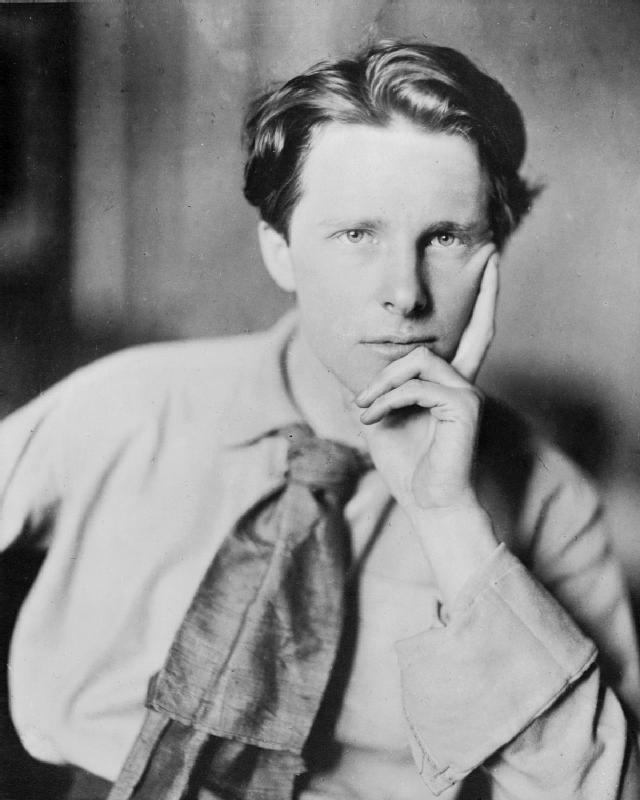

**Rupert Brooke (1887-1915)**
- Died early in war
- **"The Soldier":** "If I should die, think only this of me: / That there's some corner of a foreign field / That is for ever England"
- **Cultural icon:** Handsome, Cambridge-educated, embodied romantic warrior ideal

---

.jpg)

**Wilfred Owen (1893-1918)**
- Died one week before Armistice
- **"Dulce et Decorum Est":** Direct attack on romantic view of war - "The old Lie"
- **Technique:** Realistic imagery of gas attacks, mud, mass slaughter vs. patriotic platitudes
- **Contrast with Brooke:** Same war, completely different response based on timing of experience
- Other works: "Anthem for Doomed Youth", "Strange Meeting"

---

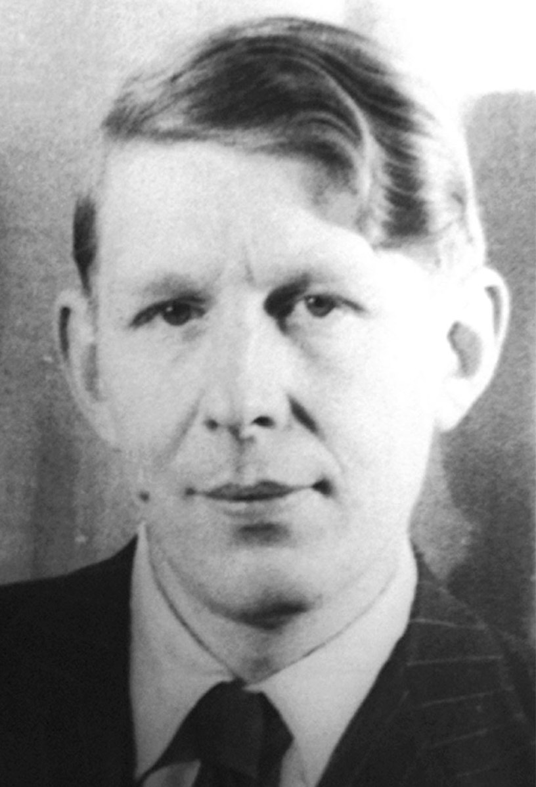

**W.H. Auden (1907-1973)**
- **1930s political engagement:** Marxist during Depression, witnessed rise of fascism firsthand
- **"Funeral Blues," "Musée des Beaux Arts":** Personal grief and artistic indifference to suffering
- **Technique:** Accessible language with complex ideas, traditional forms with modern content
- **Generational voice:** Articulated anxieties of those facing political collapse and war
- Other works: "September 1, 1939", "The Age of Anxiety"

---

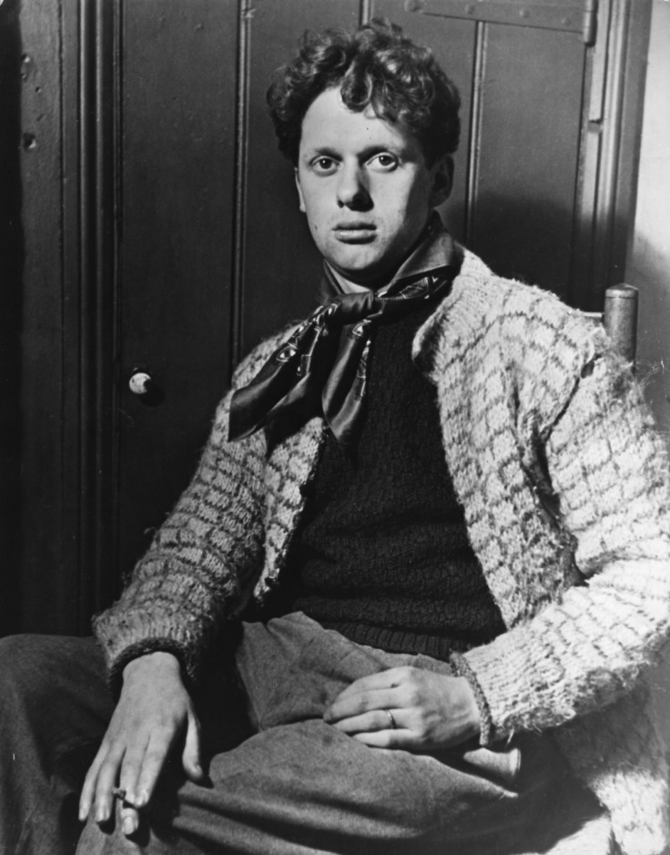

**Dylan Thomas (1914-1953)**
- Writing in English but maintaining Celtic cultural distance from England
- **"Do Not Go Gentle Into That Good Night":** Villanelle about father's death, resistance to mortality
- **"Fern Hill":** Childhood memory transformed into lyrical meditation on time and loss
- **Language:** Rich, musical, almost baroque style - reaction against modernist fragmentation
- Other works: "And Death Shall Have No Dominion", *Under Milk Wood*

---

**George Orwell (1903-1950)**
- Served as police officer in Burma, witnessed empire's corruption firsthand
- **"Shooting an Elephant":** True story of being forced to kill elephant to maintain colonial authority
- **Technique:** First-person narrative, clear prose, symbolic structure
- Other works: "Animal Farm", "Nineteen Eighty-Four"

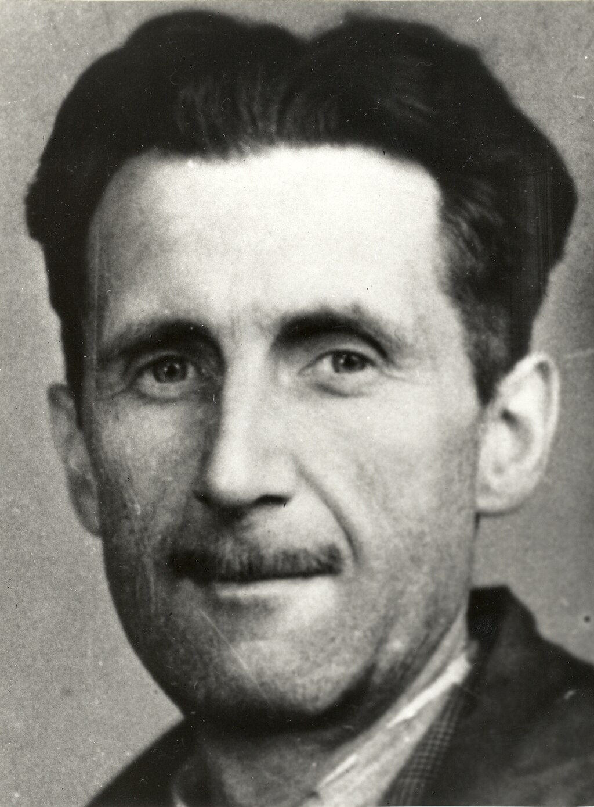

---

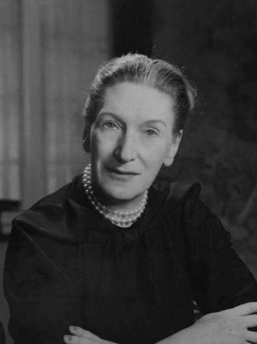

**Elizabeth Bowen (1899-1973)**
- Protestant Irish family, culturally between England and Ireland
- **"The Demon Lover":** Psychological ghost story about WWI trauma's lasting effects
- **Wartime London:** Lived through Blitz, wrote about civilian psychological damage
- **Technique:** Psychological realism, atmosphere of unease, past intruding on present
- **Class and gender:** Explored women's limited options in changing social order
- Major works: "The Heat of the Day", "The Death of the Heart"

---

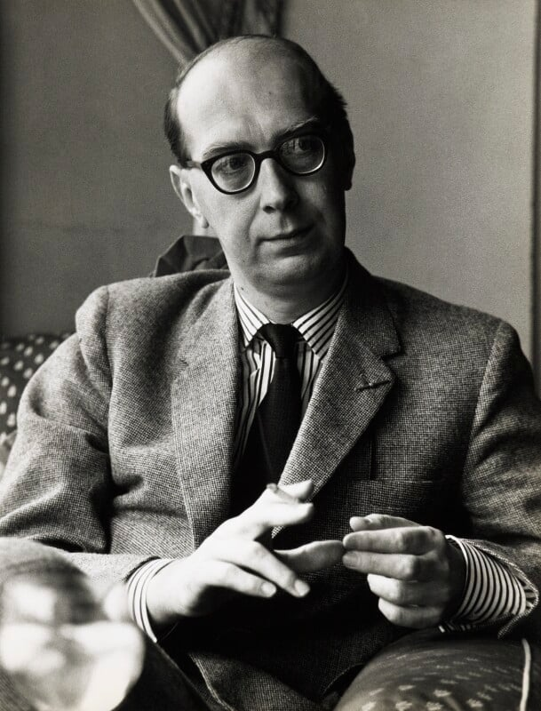

**Philip Larkin (1922-1985)**
- **Post-war disillusionment:** Direct, honest examination of ordinary English life after empire
- **"This Be the Verse":** Brutal honesty about family dysfunction - "They f*** you up, your mum and dad"
- **"Church Going":** Explores decline of religious faith in secular age
- **Technique:** Conversational language, traditional forms, pessimistic but precise observations
- **Cultural position:** Represents post-imperial England finding new identity
- Other works: "The Whitsun Weddings", "High Windows"

---

**Hanif Kureishi (1954-)**
- **British-Pakistani identity:** Explores multicultural Britain and generational conflict
- **"My Son the Fanatic":** Father-son clash over religious fundamentalism vs. Western integration
- **Postcolonial themes**: Immigration, cultural assimilation, religious identity - shows how former colonial subjects reshape British literature
- **Technique:** Third-person narration with shifts between father's and son's perspectives
- Other works: "The Buddha of Suburbia", "My Beautiful Laundrette"

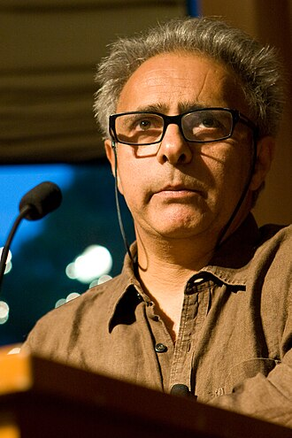

---

# Our literary texts (mandatory reading)

| **Author** | **Text** |
|------------|----------|
| Thomas Hardy | "On the Western Circuit" |
| D.H. Lawrence | "Odour of Chrysanthemums" |
| James Joyce | "Araby", "Eveline", "A Painful Case" |
| Katherine Mansfield | "The Garden Party" |
| Rupert Brooke | "The Soldier" |
| Wilfred Owen | "Dulce et Decorum Est" |
| W.H. Auden | "Funeral Blues", "Musée des Beaux Arts" |
| George Orwell | "Shooting an Elephant" |
| Dylan Thomas | "Do Not Go Gentle Into That Good Night", "Fern Hill" |
| Elizabeth Bowen | "The Demon Lover" |
| Philip Larkin | "This Be the Verse", "Church Going" |
| Hanif Kureishi | "My Son the Fanatic" |
